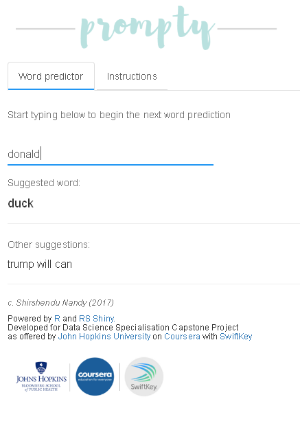

prompty  
========================================================

 
 
 
 
 
 

Shirshendu Nandy  
20th October 2017

Meet prompty
========================================================

'prompty'is a word(s) predictor that suggests the next set of words as an user types in.
- This application is developed as part of the 'Data Science Specialisation' offered through Coursera by John Hopkins University Bloomberg School of Public Health with cooperation from Swiftkey. 
- It uses training data sets of news, blogs and tweets sourced from the web and utilizes natural language processing techniques such as N-gram tokenisation to build a text predictor model.

The application is available here: http://shirshendu.shinyapps.io/prompty/

User interface
========================================================
left: 65%

* Under the 'Word predictor' tab, point your cursor below the label that says 'Start typing...' and click.
* The line will change colour and the cursoe will start blinking.
* Type in a word or a phrase.(English words only)
* A suggestion will pop under the label 'Suggested word'. This our first choice.
* The next three best options are displayed under "Other suggestions"
* To try a different word or phrase, simply delete and start typing again.

***
 
 
 

Behind the scenes
========================================================

- Data sources: https://d396qusza40orc.cloudfront.net/dsscapstone/dataset/Coursera-SwiftKey.zip.
- 1% of this data was sampled to create a training data corpus.
- Performed various data preprosseing such as removing expletives, punctuations, numbers, stopwords, lower-case conversion.
- Generated bi, tri and quadgrams - that are "contiguous sequence of n items from a given sequence of text or speech"
- Model uses "stupid Backoff" strategy that starts with the quadgrams to see if there is a match with the first three words, if so, uses the fourth word of the quadgram as the predicted word. If no matches are found then falls back to bigrams and so on.
- If no matches found after exhauting all three n-grams, common unigrams "the", "plese" will" and "can" are suggested as default.
 

References
========================================================

- Milestone report: http://rpubs.com/shirshendu/319164  
- Codes: http://github.com/shirshendu-nandy/prompty-word-predictor  

 
 

